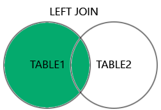

## 🏥 **Healthcare**

### **INNER JOIN**

**Use Case:** Find patients who have scheduled appointments.
**SQL:**

```sql
SELECT Patients.Name, Appointments.Date
FROM Patients
INNER JOIN Appointments ON Patients.ID = Appointments.PatientID;
```

**Relational Algebra:**

$$
Patients \bowtie_{Patients.ID = Appointments.PatientID} Appointments
$$

**Venn Representation:** `A ∩ B`


---

### **LEFT JOIN**

**Use Case:** List all patients, including those who haven’t scheduled an appointment.
**SQL:**

```sql
SELECT Patients.Name, Appointments.Date
FROM Patients
LEFT JOIN Appointments ON Patients.ID = Appointments.PatientID;
```

**Relational Algebra:**

$$
Patients \ \text{⟕}_{Patients.ID = Appointments.PatientID} \ Appointments
$$

**Venn Representation:** `A ⟶ A ∪ B (with NULLs from B)`


---

### **RIGHT JOIN**

**Use Case:** Show all appointments, even if the patient record is missing.
**SQL:**

```sql
SELECT Patients.Name, Appointments.Date
FROM Patients
RIGHT JOIN Appointments ON Patients.ID = Appointments.PatientID;
```

**Relational Algebra:**

$$
Patients \ \text{⟖}_{Patients.ID = Appointments.PatientID} \ Appointments
$$

**Venn Representation:** `B ⟶ A ∪ B (with NULLs from A)`


---

### **FULL OUTER JOIN**

**Use Case:** Audit all patients and appointments, including unmatched records.
**SQL:**

```sql
SELECT Patients.Name, Appointments.Date
FROM Patients
FULL OUTER JOIN Appointments ON Patients.ID = Appointments.PatientID;
```

**Relational Algebra:**

$$
Patients \ \text{⟗}_{Patients.ID = Appointments.PatientID} \ Appointments
$$

**Venn Representation:** `A ∪ B`


---

## 🛒 **Retail / E-commerce**

### **INNER JOIN**

**Use Case:** Get customers who placed orders.
**SQL:**

```sql
SELECT Customers.Name, Orders.OrderDate
FROM Customers
INNER JOIN Orders ON Customers.ID = Orders.CustomerID;
```

**Relational Algebra:**

$$
Customers \bowtie_{Customers.ID = Orders.CustomerID} Orders
$$


---

### **LEFT JOIN**

**Use Case:** List all customers, including those who haven’t placed any orders.
**SQL:**

```sql
SELECT Customers.Name, Orders.OrderDate
FROM Customers
LEFT JOIN Orders ON Customers.ID = Orders.CustomerID;
```

**Relational Algebra:**

$$
Customers \ \text{⟕}_{Customers.ID = Orders.CustomerID} \ Orders
$$


---

### **RIGHT JOIN**

**Use Case:** Show all orders, even if customer data is incomplete.
**SQL:**

```sql
SELECT Customers.Name, Orders.OrderDate
FROM Customers
RIGHT JOIN Orders ON Customers.ID = Orders.CustomerID;
```

**Relational Algebra:**

$$
Customers \ \text{⟖}_{Customers.ID = Orders.CustomerID} \ Orders
$$


---

### **FULL OUTER JOIN**

**Use Case:** Combine customer and order data for a full report, including gaps.
**SQL:**

```sql
SELECT Customers.Name, Orders.OrderDate
FROM Customers
FULL OUTER JOIN Orders ON Customers.ID = Orders.CustomerID;
```

**Relational Algebra:**

$$
Customers \ \text{⟗}_{Customers.ID = Orders.CustomerID} \ Orders
$$


---

## 🎓 **Education / Academic**

### **INNER JOIN**

**Use Case:** Find students who are enrolled in courses.
**SQL:**

```sql
SELECT Students.Name, Enrollments.CourseID
FROM Students
INNER JOIN Enrollments ON Students.ID = Enrollments.StudentID;
```

**Relational Algebra:**

$$
Students \bowtie_{Students.ID = Enrollments.StudentID} Enrollments
$$


---

### **LEFT JOIN**

**Use Case:** List all students, including those not enrolled in any course.
**SQL:**

```sql
SELECT Students.Name, Enrollments.CourseID
FROM Students
LEFT JOIN Enrollments ON Students.ID = Enrollments.StudentID;
```

**Relational Algebra:**

$$
Students \ \text{⟕}_{Students.ID = Enrollments.StudentID} \ Enrollments
$$


---

### **RIGHT JOIN**

**Use Case:** Show all courses, even if no students are enrolled.
**SQL:**

```sql
SELECT Students.Name, Courses.Title
FROM Students
RIGHT JOIN Enrollments ON Students.ID = Enrollments.StudentID
RIGHT JOIN Courses ON Enrollments.CourseID = Courses.ID;
```

**Relational Algebra:**

$$
(Students \ \text{⟕}_{Students.ID = Enrollments.StudentID} Enrollments) \ \text{⟖}_{Enrollments.CourseID = Courses.ID} \ Courses
$$


---

### **FULL OUTER JOIN**

**Use Case:** Full academic audit of students and courses.
**SQL:**

```sql
SELECT Students.Name, Courses.Title
FROM Students
FULL OUTER JOIN Enrollments ON Students.ID = Enrollments.StudentID
FULL OUTER JOIN Courses ON Enrollments.CourseID = Courses.ID;
```

**Relational Algebra:**

$$
(Students \ \text{⟗}_{Students.ID = Enrollments.StudentID} Enrollments) \ \text{⟗}_{Enrollments.CourseID = Courses.ID} \ Courses
$$


---

## ✅ **SQL ↔ Relational Algebra ↔ Venn Diagram Cheat Sheet**

| **Join Type**       | **SQL Syntax**                                         | **Relational Algebra**          | **Venn Diagram / Concept**                                                                                   |
| ------------------- | ------------------------------------------------------ | ------------------------------- | ------------------------------------------------------------------------------------------------------------ |
| **INNER JOIN**      | `SELECT ... FROM A INNER JOIN B ON A.ID = B.AID;`      | $A \bowtie_{A.ID=B.AID} B$      | 🔵⚫ Overlap only (`A ∩ B`) <br>                            |
| **LEFT JOIN**       | `SELECT ... FROM A LEFT JOIN B ON A.ID = B.AID;`       | $A \ \text{⟕}_{A.ID=B.AID} \ B$ | 🔵 All of A + matched B (`A ∪ matched B`) <br>   |
| **RIGHT JOIN**      | `SELECT ... FROM A RIGHT JOIN B ON A.ID = B.AID;`      | $A \ \text{⟖}_{A.ID=B.AID} \ B$ | ⚫ All of B + matched A (`B ∪ matched A`) <br>  |
| **FULL OUTER JOIN** | `SELECT ... FROM A FULL OUTER JOIN B ON A.ID = B.AID;` | $A \ \text{⟗}_{A.ID=B.AID} \ B$ | 🔵⚫ Everything from A and B (`A ∪ B`) <br>       |

> 🔹 **Legend for colors**:
> 🔵 = Table A
> ⚫ = Table B

