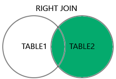

## 🏥 **Healthcare**

### **INNER JOIN**
**Use Case:** Find patients who have scheduled appointments.

```sql
SELECT Patients.Name, Appointments.Date
FROM Patients
INNER JOIN Appointments ON Patients.ID = Appointments.PatientID;
```
**Venn Representation:** `A ∩ B`  


### **LEFT JOIN**
**Use Case:** List all patients, including those who haven’t scheduled an appointment.

```sql
SELECT Patients.Name, Appointments.Date
FROM Patients
LEFT JOIN Appointments ON Patients.ID = Appointments.PatientID;
```
**Venn Representation:** `A ⟶ A ∪ B (with NULLs from B)`


### **RIGHT JOIN**
**Use Case:** Show all appointments, even if the patient record is missing (e.g., imported from external system).

```sql
SELECT Patients.Name, Appointments.Date
FROM Patients
RIGHT JOIN Appointments ON Patients.ID = Appointments.PatientID;
```
**Venn Representation:** `B ⟶ A ∪ B (with NULLs from A)`


### **FULL OUTER JOIN**
**Use Case:** Audit all patients and appointments, including unmatched records.

```sql
SELECT Patients.Name, Appointments.Date
FROM Patients
FULL OUTER JOIN Appointments ON Patients.ID = Appointments.PatientID;
```
**Venn Representation:** `A ∪ B`

---

## 🛒 **Retail / E-commerce**

### **INNER JOIN**
**Use Case:** Get customers who placed orders.

```sql
SELECT Customers.Name, Orders.OrderDate
FROM Customers
INNER JOIN Orders ON Customers.ID = Orders.CustomerID;
```


### **LEFT JOIN**
**Use Case:** List all customers, including those who haven’t placed any orders.

```sql
SELECT Customers.Name, Orders.OrderDate
FROM Customers
LEFT JOIN Orders ON Customers.ID = Orders.CustomerID;
```


### **RIGHT JOIN**
**Use Case:** Show all orders, even if customer data is incomplete.

```sql
SELECT Customers.Name, Orders.OrderDate
FROM Customers
RIGHT JOIN Orders ON Customers.ID = Orders.CustomerID;
```


### **FULL OUTER JOIN**
**Use Case:** Combine customer and order data for a full report, including gaps.

```sql
SELECT Customers.Name, Orders.OrderDate
FROM Customers
FULL OUTER JOIN Orders ON Customers.ID = Orders.CustomerID;
```

---

## 🎓 **Education / Academic**

### **INNER JOIN**
**Use Case:** Find students who are enrolled in courses.

```sql
SELECT Students.Name, Enrollments.CourseID
FROM Students
INNER JOIN Enrollments ON Students.ID = Enrollments.StudentID;
```


### **LEFT JOIN**
**Use Case:** List all students, including those not enrolled in any course.

```sql
SELECT Students.Name, Enrollments.CourseID
FROM Students
LEFT JOIN Enrollments ON Students.ID = Enrollments.StudentID;
```


### **RIGHT JOIN**
**Use Case:** Show all courses, even if no students are enrolled.

```sql
SELECT Students.Name, Courses.Title
FROM Students
RIGHT JOIN Enrollments ON Students.ID = Enrollments.StudentID
RIGHT JOIN Courses ON Enrollments.CourseID = Courses.ID;
```


### **FULL OUTER JOIN**
**Use Case:** Full academic audit of students and courses.

```sql
SELECT Students.Name, Courses.Title
FROM Students
FULL OUTER JOIN Enrollments ON Students.ID = Enrollments.StudentID
FULL OUTER JOIN Courses ON Enrollments.CourseID = Courses.ID;
```

