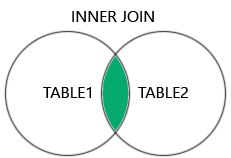
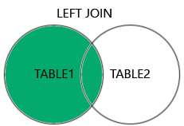
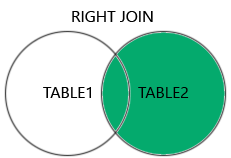
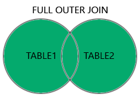

Here’s a visual and conceptual breakdown of the **different types of SQL JOINs** using diagrams and explanations:

---

### **1. INNER JOIN**
**Returns only the rows with matching values in both tables.**

**Diagram:**
```
Table A:      Table B:
+----+        +----+
| A1 |        | B1 |
| A2 |        | B2 |
| A3 |        | B3 |
+----+        +----+

INNER JOIN Result:
Only rows where A and B have matching keys.
```

**Venn Representation:**
```
[A] ∩ [B]
```

---

### **2. LEFT (OUTER) JOIN**
**Returns all rows from the left table (A), and matched rows from the right table (B). Unmatched rows from B will be NULL.**

**Diagram:**
```
LEFT JOIN Result:
All rows from A, matched rows from B, NULLs where no match.
```

**Venn Representation:**
```
[A] ⟶ [A ∪ B], but only A's full set with B's matches
```

---

### **3. RIGHT (OUTER) JOIN**
**Returns all rows from the right table (B), and matched rows from the left table (A). Unmatched rows from A will be NULL.**

**Diagram:**
```
RIGHT JOIN Result:
All rows from B, matched rows from A, NULLs where no match.
```

**Venn Representation:**
```
[B] ⟶ [A ∪ B], but only B's full set with A's matches
```

---

### **4. FULL (OUTER) JOIN**
**Returns all rows when there is a match in either table. Unmatched rows will have NULLs in place of missing data.**

**Diagram:**
```
FULL JOIN Result:
All rows from A and B, matched where possible, NULLs otherwise.
```

**Venn Representation:**
```
[A] ∪ [B]
```

---
